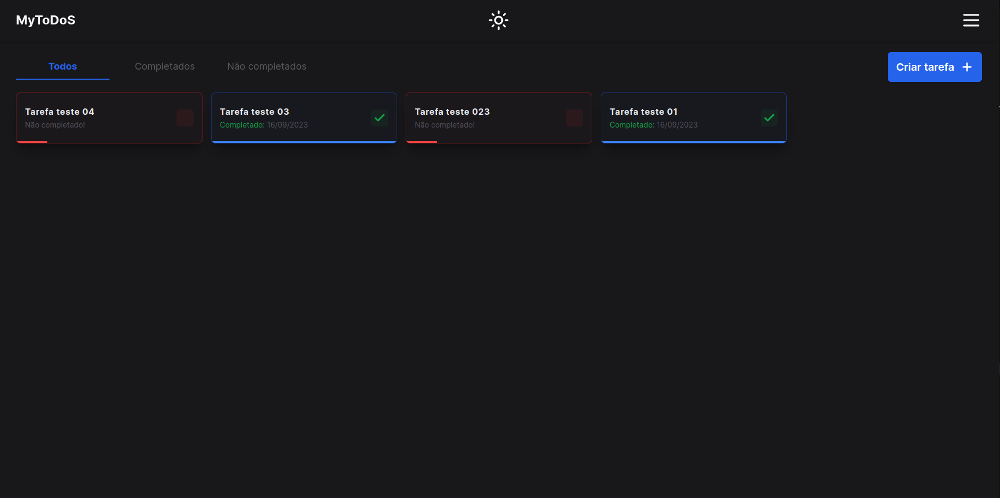

<h1 align="center">Habits</h1>

  [Projeto](#projeto) 
  &nbsp;&nbsp;&nbsp;|&nbsp;&nbsp;&nbsp;
  [Tecnologias](#tecnologias)
  &nbsp;&nbsp;&nbsp;

 

 
 

## 💻 Projeto 

Um projeto fullstack simples para gestão de tarefas.

 
 

## 🚀 Tecnologias 

- TypeScript
- Node.JS
- Epress.js
- TypeORM
- Docker
- PostgreSQL
- Next.js
- Tailwindcss

 

